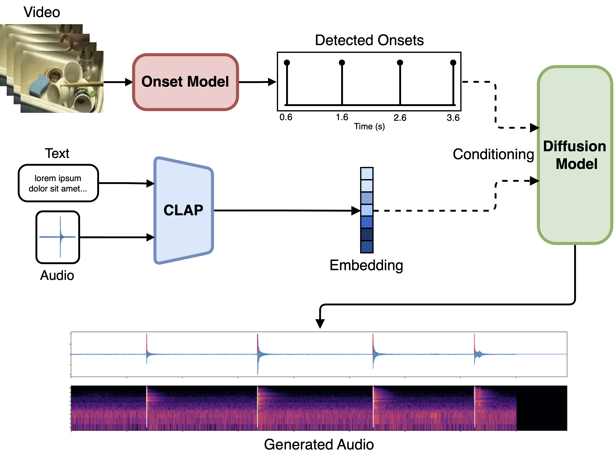

<div align="center">

# SyncFusion

**Multimodal Onset-Synchronized Video-to-Audio Foley Synthesis**

[Paper](https://arxiv.org/abs/2211.00497) | [Webpage](https://mcomunita.github.io/gcn-tfilm_page/)

[Marco Comunità](https://mcomunita.github.io/)<sup>1</sup>, [Riccardo F. Gramaccioni](https://www.linkedin.com/in/riccardo-fosco-gramaccioni/)<sup>2</sup>, [Emilian Postolache](https://emilianpostolache.com/)<sup>2</sup><br>[Emanuele Rodolà,](https://www.linkedin.com/in/erodola/)<sup>2</sup>, [Danilo Comminiello](https://www.linkedin.com/in/danilocomminiello/)<sup>2</sup>, [Joshua D. Reiss](http://www.eecs.qmul.ac.uk/~josh/)<sup>1</sup>

<sup>1</sup> Centre for Digital Music, Queen Mary University of London, UK<br><sup>2</sup> Sapienza University of Rome, Italy

<!-- {width=200} -->


</div>

## Abstract
Sound design involves creatively selecting, recording, and editing sound effects for various media like cinema, video games, and virtual/augmented reality. One of the most time-consuming steps when designing sound is synchronizing audio with video. In some cases, environmental recordings from video shoots are available, which can aid in the process. However, in video games and animations, no reference audio exists, requiring manual annotation of event timings from the video. We propose a system to extract repetitive actions onsets from a video, which are then used - in conjunction with audio or textual embeddings - to condition a diffusion model trained to generate a new synchronized sound effects audio track. In this way, we leave complete creative control to the sound designer while removing the burden of synchronization with video. Furthermore, editing the onset track or changing the conditioning embedding requires much less effort than editing the audio track itself, simplifying the sonification process. We provide sound examples, source code, and pretrained models to faciliate reproducibility


```BibTex
@inproceedings{comunita2024syncfusion,
  title={Syncfusion: Multimodal Onset-Synchronized Video-to-Audio Foley Synthesis},
  author={Comunit{\`a}, Marco and Gramaccioni, Riccardo F and Postolache, Emilian and Rodol{\`a}, Emanuele and Comminiello, Danilo and Reiss, Joshua D},
  booktitle={ICASSP 2024-2024 IEEE International Conference on Acoustics, Speech and Signal Processing (ICASSP)},
  pages={936--940},
  year={2024},
  organization={IEEE}
}
```

---
## Setup

Install the requirements.
```
python3 -m venv .venv
source .venv/bin/activate
python3 -m pip install -r requirements.txt
```

---
## Dataset
You can find the GREATEST HITS dataset page at [https://andrewowens.com/vis/](https://andrewowens.com/vis/), where you can download the [high-res](https://web.eecs.umich.edu/~ahowens/vis/vis-data.zip) or [low-res](https://web.eecs.umich.edu/~ahowens/vis/vis-data-256.zip) videos and annotations.

---
## Pre-processing for Onset Model
To prepare the dataset for training you have to pre-process the videos and annotations, as well as prepare the data split.

### Video Pre-processing
To extract the video frames and audio from videos run (setting the arguments as necessary)
```
python script/gh_preprocess_videos.py
```

### Annotations
To extract the annotation run (setting the arguments as necessary):
```
python script/gh_preprocess_videos.py
```

### Data Splits
To prepare the data splits run (setting the arguments as necessary):
```
python script/gh_preprocess_split.py
```

---
## Preprocessing for Diffusion Model

Coming...

---
## Training Onset Model

To train the onset model WITHOUT data augmentation run:
```
CUDA_VISIBLE_DEVICES=0,1 sh script/train-onset-gh.sh
```
The training is configured using Lightning CLI with the following files:
```
cfg/data/data-onset-greatesthit.yaml
cfg/model/model-onset.yaml
cfg/trainer/trainer-onset.yaml
```
Check the files and change the arguments as necessary.

---
To train the onset model WITH data augmentation run:
```
CUDA_VISIBLE_DEVICES=0,1 sh script/train-onset-gh-augment.sh
```
The training is configured using Lightning CLI with the following files:
```
cfg/data/data-onset-greatesthit-augment.yaml
cfg/model/model-onset.yaml
cfg/trainer/trainer-onset-augment.yaml
```
Check the files and change the arguments as necessary.

---
## Training Diffusion Model

To train the diffusion model run:
```
CUDA_VISIBLE_DEVICES=0,1 sh script/train-diffusion-gh.sh
```
The training is configured using Hydra with the following files:
```
exp/model/diffusion.yaml
exp/train_diffusion_gh.yaml
```
Check the files and change the arguments as necessary.

---
## Testing Onset Model

To train the onset model run:
```
CUDA_VISIBLE_DEVICES=0,1 sh script/test-onset.sh
```
changing the necessary arguments.

---
## Testing Diffusion Model

Coming...

---
## Checkpoints

Coming...

---
## Credits

[https://github.com/archinetai/audio-diffusion-pytorch-trainer](https://github.com/archinetai/audio-diffusion-pytorch-trainer)
[https://github.com/XYPB/CondFoleyGen](https://github.com/XYPB/CondFoleyGen)
[https://andrewowens.com/vis/](https://andrewowens.com/vis/)
